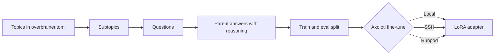

# overbrainer

Distill a large "parent" LLM into a smaller open-weights "child" model, from the command line.

[](https://crates.io/crates/overbrainer)
[](https://github.com/nayrosk/overbrainer/actions/workflows/ci.yml)
[](#license)
[](https://github.com/nayrosk/overbrainer/releases)


overbrainer asks an LLM for questions on your topics, collects answers and their reasoning from a parent model, then fine-tunes a child model with Axolotl on this machine, over SSH or on Runpod. A terminal UI shows the dataset and the training runs as they progress.

Status: early development. Expect breaking changes between minor versions until 1.0.

## How it works



A generator model writes the subtopics and questions, and drops near-duplicates. The parent model answers each question; answers that were truncated, refused or empty, or that lack the raw reasoning asked for, are kept for inspection and left out of training. `split` writes `data/train.jsonl` and `data/eval.jsonl` in Axolotl's chat format, and `train` fine-tunes the base model on them.

## Install

### Download a binary

Each [GitHub release](https://github.com/nayrosk/overbrainer/releases) has a binary for three targets:

- `x86_64-unknown-linux-musl`: Linux on x86-64, statically linked
- `aarch64-unknown-linux-musl`: Linux on ARM64, statically linked
- `aarch64-apple-darwin`: macOS on Apple silicon

Each archive holds `overbrainer`, the README and the licenses, next to a `.sha256` file. On Linux:

```bash
version=v0.1.1
target=x86_64-unknown-linux-musl   # or aarch64-unknown-linux-musl
file="overbrainer-$version-$target.tar.gz"
curl -LO "https://github.com/nayrosk/overbrainer/releases/download/$version/$file"
curl -LO "https://github.com/nayrosk/overbrainer/releases/download/$version/$file.sha256"
sha256sum -c "$file.sha256"
tar xzf "$file" overbrainer
sudo install overbrainer /usr/local/bin/
```

On macOS, set `target=aarch64-apple-darwin` and check the archive with `shasum -a 256 -c "$file.sha256"`.

### Build with cargo

```bash
cargo install --locked overbrainer
```

The latest code from `main` installs with `cargo install --locked --git https://github.com/nayrosk/overbrainer`.

### Requirements

- Rust 1.89 or newer to build it. CI builds and tests on Linux, and checks that it builds on macOS.
- `ssh` for SSH targets, and `ssh` with `ssh-keygen` for Runpod targets.
- For training on this machine: Axolotl 0.19 in a virtual environment or on `PATH`, or Docker or Podman with NVIDIA GPU access to run the Axolotl image.

## Quickstart


```bash
overbrainer init my-project && cd my-project
cp .env.example .env        # fill in the provider URL and key
overbrainer config check    # prints the resolved configuration, secrets masked
overbrainer run             # subtopics, questions, answers, split, then train
overbrainer tui             # browse the dataset and follow the runs
```

`init` writes `overbrainer.toml`, `.env.example`, the prompt templates in `prompts/` and a `.gitignore`. Edit the topics in `overbrainer.toml` before `run`. `run` trains only when `overbrainer.toml` has a `[training]` section; otherwise it stops after `split`. Each stage also runs on its own (`subtopics`, `questions`, `answers`, `split`, `train`) and resumes where it stopped: see [the dataset pipeline](docs/pipeline.md).

## Providers

A provider is any API that speaks the OpenAI chat completions protocol or the Anthropic Messages API. `overbrainer.toml` names it and its protocol; the URL and the key come from the environment. OpenRouter and NanoGPT both work, and both publish prices, so every stage prints what it cost.

```toml
[providers.openrouter]
protocol = "openai"

[providers.nanogpt]
protocol = "openai"

[roles]
generator = { provider = "nanogpt", model = "qwen/qwen3-235b-a22b-instruct-2507" }
parent = { provider = "openrouter", model = "deepseek/deepseek-r1", reasoning = true }
```

```bash
OVERBRAINER_PROVIDERS__OPENROUTER__BASE_URL=https://openrouter.ai/api/v1
OVERBRAINER_PROVIDERS__OPENROUTER__API_KEY=sk-or-...
OVERBRAINER_PROVIDERS__NANOGPT__BASE_URL=https://nano-gpt.com/api/v1
OVERBRAINER_PROVIDERS__NANOGPT__API_KEY=...
```

NanoGPT: [nano-gpt.com](https://nano-gpt.com/r/HLFz47L6) (referral link). Any key can also be a `vault:` reference to a Vault or OpenBao secret. [Configuration](docs/configuration.md) covers roles, pipeline settings, secrets and logs.

## Training targets

| Target | Where the job runs | Cost and guards |
|---|---|---|
| `local` | This machine, natively or in a Docker or Podman container. | Your own GPU. |
| `ssh` | A machine you reach with `ssh`, natively or in a container. | Your own GPU. The job survives a lost connection. |
| `runpod` | A pod created for the run on Runpod Secure Cloud, deleted once the results are back. | Billed per second by Runpod. A watchdog on the pod deletes it at `max_hours` at the latest, and `gpu_types` are tried in order until one is available. |

Runpod: [runpod.io](https://runpod.io?ref=ym24z23f) (referral link). A run's LoRA adapter (or full model) lands in `runs/<run-id>/output/`. `train attach` follows a run again after Ctrl-C, and `train cancel` stops it. [Training](docs/training.md) covers targets, settings and the Hugging Face token; [Runpod](docs/runpod.md) covers pods, the watchdog and costs.

## Terminal UI

`overbrainer tui` has four views:

- Dataset (`1`): the topics, subtopics, questions and answers as a tree, with each answer's reasoning, stats and a filter. Edit or delete items in place.
- Pipeline (`2`): run a stage and watch its progress, tokens and cost.
- Training (`3`): the runs, with progress, pod, spend, a loss chart and learning rate and gradient norm sparklines. Start, follow or cancel a run.
- Logs (`4`): the captured log lines, filtered by level.

| Keys | Action |
|---|---|
| `1` to `4`, Tab, Shift-Tab | Switch view. |
| `?` | The keys of the current view. |
| `j` `k`, `l` `h` | Move, expand and collapse. |
| `/`, `s` | Filter the tree, show the stats. |
| `e`, `d` | Edit in `$EDITOR`, delete (asks first). |
| `r` | Run a pipeline stage. |
| `t`, `a`, `c` | Start, attach to, or cancel a training run. |
| `R` | Reload from disk. |
| `q`, Ctrl-C | Quit (asks first when work is running). |

The TUI draws its own crimson theme in 24-bit or 256 colors, and falls back to the terminal's 16 colors. `OVERBRAINER_TUI_COLOR` (`truecolor`, `256` or `16`) and `OVERBRAINER_TUI_MOTION` (`on`, `reduced` or `off`) override the detection, and `NO_COLOR` turns it monochrome. [The TUI page](docs/tui.md) has every key and behavior.

## Documentation

- [The dataset pipeline](docs/pipeline.md): stages, resuming, deduplication, the split, the answer format, reasoning and prompt templates.
- [Configuration](docs/configuration.md): `overbrainer.toml`, environment variables, providers, roles, pipeline settings, Vault and logs.
- [Training](docs/training.md): runs, local and SSH targets, the Hugging Face token, chat templates and training settings.
- [Runpod](docs/runpod.md): pods, the watchdog, `--keep-pod`, stray pods and custom images.
- [Terminal UI](docs/tui.md): views, keys, editing, quitting, color and motion.

## Releasing

Releases are cut by hand from `main`:

1. Open a release pull request from a `chore/release-vX.Y.Z` branch. It bumps the version in `Cargo.toml` (cargo updates `Cargo.lock` on the next build) and regenerates the changelog with [git-cliff](https://git-cliff.org): `git cliff --tag vX.Y.Z -o CHANGELOG.md`. `cliff.toml` holds the changelog format.
2. Review and merge that pull request.
3. Tag the merge commit with a signed tag and push it: `git tag -s vX.Y.Z -m vX.Y.Z && git push origin vX.Y.Z`.
4. The tag runs `.github/workflows/release.yml`. It checks that the tag matches `Cargo.toml`, runs the checks and `cargo semver-checks`, builds the binaries, publishes the crate to crates.io and creates the GitHub release from the changelog entry with the binaries attached.

To test the release build from a branch without publishing, run the release workflow by hand: a manual run verifies and builds, and never publishes.

## Terms of service

Several model providers forbid using their outputs to train models that compete with them. This includes OpenAI and Anthropic, and the restriction still applies when their models are reached through a gateway such as OpenRouter or NanoGPT. Check the terms of the models you configure as parent before training on their outputs.

## License

Licensed under either of [MIT](LICENSE-MIT) or [Apache-2.0](LICENSE-APACHE) at your option.
