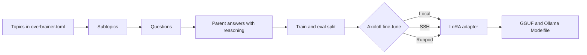

# overbrainer

Distill a large "parent" LLM into a smaller open-weights "child" model, from the command line.

[](https://crates.io/crates/overbrainer)
[](https://github.com/nayrosk/overbrainer/actions/workflows/ci.yml)
[](#license)
[](https://github.com/nayrosk/overbrainer/releases)


overbrainer asks an LLM for questions on your topics, collects answers and their reasoning from a parent model, then fine-tunes a child model with Axolotl on this machine, over SSH or on Runpod. A terminal UI shows the dataset and the training runs as they progress.

Status: early development. Expect breaking changes between minor versions until 1.0.

## How it works


```mermaid
flowchart LR
    T[Topics in overbrainer.toml] --> S[Subtopics]
    S --> Q[Questions]
    Q --> A[Parent answers with reasoning]
    A --> SP[Train and eval split]
    SP --> F{Axolotl fine-tune}
    F -->|Local| L[LoRA adapter]
    F -->|SSH| L
    F -->|Runpod| L
    L --> G[GGUF and Ollama Modelfile]
```

A generator model writes the subtopics and questions, and drops near-duplicates. The parent model answers each question; answers that were truncated, refused or empty, or that lack the raw reasoning asked for, are kept for inspection and left out of training. `split` writes `data/train.jsonl` and `data/eval.jsonl` in Axolotl's chat format, and `train` fine-tunes the base model on them. `export` turns the result into a quantized GGUF with an Ollama Modelfile, on the same target.

## Install

### Download a binary

Each [GitHub release](https://github.com/nayrosk/overbrainer/releases) has a binary for three targets:

- `x86_64-unknown-linux-musl`: Linux on x86-64, statically linked
- `aarch64-unknown-linux-musl`: Linux on ARM64, statically linked
- `aarch64-apple-darwin`: macOS on Apple silicon

Each archive holds `overbrainer`, the README and the licenses, next to a `.sha256` file. On Linux:

```bash
version=v0.6.1
target=x86_64-unknown-linux-musl   # or aarch64-unknown-linux-musl
file="overbrainer-$version-$target.tar.gz"
curl -LO "https://github.com/nayrosk/overbrainer/releases/download/$version/$file"
curl -LO "https://github.com/nayrosk/overbrainer/releases/download/$version/$file.sha256"
sha256sum -c "$file.sha256"
tar xzf "$file" overbrainer
sudo install overbrainer /usr/local/bin/
```

On macOS, set `target=aarch64-apple-darwin` and check the archive with `shasum -a 256 -c "$file.sha256"`.

### Build with cargo

```bash
cargo install --locked overbrainer
```

The release binaries include the built-in SSH client. A build from source needs `--features builtin-ssh` to have it: `cargo install --locked overbrainer --features builtin-ssh`.

The latest code from `main` installs with `cargo install --locked --git https://github.com/nayrosk/overbrainer`.

### Requirements

- Rust 1.91 or newer to build it. CI builds and tests on Linux, and checks that it builds on macOS.
- `ssh` for SSH targets, and `ssh` with `ssh-keygen` for Runpod targets, unless you use the built-in SSH client.
- For training on this machine: Axolotl 0.19 in a virtual environment or on `PATH`, or Docker or Podman with NVIDIA GPU access to run the Axolotl image.

> [!TIP]
> If `ssh` is a sandbox wrapper such as firejail, or missing, set `ssh_client = "builtin"` on the target (or `OVERBRAINER_SSH_CLIENT=builtin`) to use the built-in SSH client, which needs no `ssh` binary. See [Built-in SSH client](docs/training.md#built-in-ssh-client).

### Shell completions

overbrainer completes its commands and flags in bash, zsh and fish. It also completes run IDs (with their state and target), topic names and target names, read from the project in the current directory or the one given with `-C`. Add the line for your shell to its startup file:

```bash
source <(COMPLETE=bash overbrainer)          # ~/.bashrc
source <(COMPLETE=zsh overbrainer)           # ~/.zshrc
COMPLETE=fish overbrainer | source           # ~/.config/fish/completions/overbrainer.fish
```

The script must match the installed version, so generate it when the shell starts, as above, rather than saving it to a file.

overbrainer also checks crates.io once a day for a newer release, and prints a note on stderr (or in the TUI footer) when one exists. The command line waits at most 0.5 s after the command for the answer. The request sends your overbrainer version, in the User-Agent, to crates.io; nothing else. A failed check waits an hour before trying again. Set `OVERBRAINER_NO_UPDATE_CHECK` to skip it; see [Configuration](docs/configuration.md#update-check).

## Quickstart


```bash
overbrainer init my-project && cd my-project
cp .env.example .env        # fill in the provider URL and key
overbrainer config check    # prints the resolved configuration, secrets masked
overbrainer run             # subtopics, questions, answers, split, then train
overbrainer history         # what each stage did and spent
overbrainer tui             # browse the dataset and follow the runs
```

Or let the TUI ask: `overbrainer tui` in an empty directory opens a wizard that asks for the provider, its key, the models, the topics and where to train, writes `overbrainer.toml`, `.env` (mode 600), `.env.example`, `prompts/` and `.gitignore`, then offers to start auto mode, which runs every stage then training after one confirmation. See [the TUI page](docs/tui.md#the-init-wizard).

`init` writes `overbrainer.toml`, `.env.example`, the prompt templates in `prompts/` and a `.gitignore`. Edit the topics in `overbrainer.toml` before `run`. `run` trains only when `overbrainer.toml` has a `[training]` section; otherwise it stops after `split`. After training, it prints where the adapter is, and the merged model with `merge = true`. Each stage also runs on its own (`subtopics`, `questions`, `answers`, `split`, `train`) and resumes where it stopped: see [the dataset pipeline](docs/pipeline.md). Only one overbrainer process writes to a project at a time; a second one fails at once, naming the first one's PID. Changes to `overbrainer.toml` and `.env` apply without a restart: the TUI reloads them within 2 seconds, and `run` between stages (see [reloading](docs/configuration.md#reloading-while-overbrainer-runs)).

A project made before overbrainer 0.4.0 makes every command say `this project predates overbrainer 0.4.0: run overbrainer migrate`. `overbrainer migrate` (or `overbrainer migrate --dry-run` to see the changes first) brings it up to date once; see [migrating a project](docs/pipeline.md#migrating-a-project).

## Providers

A provider is any API that speaks the OpenAI chat completions protocol or the Anthropic Messages API. `overbrainer.toml` names it and its protocol; the URL and the key come from the environment. OpenRouter and NanoGPT both work, and both publish prices, so every stage prints what it cost.

```toml
[providers.openrouter]
protocol = "openai"

[providers.nanogpt]
protocol = "openai"

[roles]
generator = { provider = "nanogpt", model = "qwen/qwen3-235b-a22b-instruct-2507" }
parent = { provider = "openrouter", model = "deepseek/deepseek-r1", reasoning = true }
```

```bash
OVERBRAINER_PROVIDERS__OPENROUTER__BASE_URL=https://openrouter.ai/api/v1
OVERBRAINER_PROVIDERS__OPENROUTER__API_KEY=sk-or-...
OVERBRAINER_PROVIDERS__NANOGPT__BASE_URL=https://nano-gpt.com/api/v1
OVERBRAINER_PROVIDERS__NANOGPT__API_KEY=...
```

NanoGPT: [nano-gpt.com](https://nano-gpt.com/r/HLFz47L6) (referral link). Any key can also be a `vault:` reference to a Vault or OpenBao secret. [Configuration](docs/configuration.md) covers roles, pipeline settings, secrets and logs.

## Training targets

| Target | Where the job runs | Cost and guards |
|---|---|---|
| `local` | This machine, natively or in a Docker or Podman container. | Your own GPU. |
| `ssh` | A machine you reach with `ssh`, natively or in a container. | Your own GPU. The job survives a lost connection. |
| `runpod` | A pod created for the run on Runpod Secure Cloud, deleted once the results are back. | Billed per second by Runpod. A watchdog on the pod deletes it at `max_hours` once overbrainer no longer follows a job that makes progress, and `gpu_types` are tried in order until one is available, or `"auto"` picks every GPU type in stock with enough VRAM for the model (estimated from Hugging Face), cheapest first, when the run starts. |

Runpod: [runpod.io](https://runpod.io?ref=ym24z23f) (referral link). A run's LoRA adapter (or full model) lands in `runs/<run-id>/output/`. `train attach` follows a run again after Ctrl-C, `train cancel` stops it, and `train stop` stops it with a snapshot that `train --resume-from RUN_ID` starts a new run from; on Runpod a snapshot is also taken before `max_hours` or an optional `max_cost_usd` would end the pod, or before the pod's disk fills (an optional `max_volume_gb` grows a network volume first). `overbrainer export RUN_ID` (or `[export] after_training = true`) merges the adapter, converts the model to GGUF with a pinned llama.cpp release and quantizes it, then writes an Ollama `Modelfile` beside it in `runs/<run-id>/output/gguf/`; `--ollama NAME` also runs `ollama create`. `overbrainer push RUN_ID` uploads the run's model to a Hugging Face repo (private unless `--public`) with a generated model card, and `[hub] after_training = true` does it after each run. `overbrainer runs logs RUN_ID --pod` prints the pod's own logs, which overbrainer keeps in the run directory so they outlive the pod. `overbrainer pod gpus`, `pod datacenters`, `pod volumes` and `pod templates` read the Runpod catalog and account, so `gpu_types`, `data_center_ids`, `network_volume_id` and `image` can be set to something actually in stock or owned by the account. [Training](docs/training.md) covers targets, settings and the Hugging Face token; [Runpod](docs/runpod.md) covers the catalog, `"auto"`, pods, the watchdog and costs.

## Terminal UI

In a directory without `overbrainer.toml`, `overbrainer tui` opens an init wizard first: it asks for the project name, a provider preset and its key, the roles, the topics and the training target, then writes the project and opens it.


`overbrainer tui` has five views, and opens on Project:

- Project (`1`): the effective configuration by section, with env-set and secret values marked, next to the project's stats. Edit a field, add or delete a topic, provider or target: each change is validated and saved to `overbrainer.toml` at once, its comments kept, and `u` undoes the last one.
- Dataset (`2`): the topics, subtopics and questions as a tree, with a question's answer, reasoning, stats and a filter in a detail pane. Edit or delete a question, its answer or a subtopic in place.
- Pipeline (`3`): run a stage, or auto mode (every stage then training, `A`), and watch its progress, tokens and cost, live as it runs.
- Training (`4`): the runs, with progress, pod, spend, a loss chart and learning rate and gradient norm sparklines. Start, follow or cancel a run.
- Logs (`5`): the captured log lines, filtered by level, exportable to a file.

| Keys | Action |
|---|---|
| `1` to `5`, Tab, Shift-Tab | Switch view. |
| `?` | The keys of the current view. |
| `j` `k`, `l` `h`, Enter | Move, expand and collapse (Enter toggles); in Project, move and edit a field. |
| `/`, `s` | Filter the tree, show the stats. |
| `[` `]` | Jump the detail between a question, its reasoning and its answer. |
| `e`, `d` | Edit in `$EDITOR`, delete (asks first); in Project, `d` deletes the selected topic, provider or target. |
| `E`, `D` | Edit or delete only a question's answer; in Project, `E` opens `overbrainer.toml` in `$EDITOR`. |
| `a` | Attach to a training run; in Project, add a topic, a provider or a target. |
| `u` | In Project, undo the last write to `overbrainer.toml`. |
| `r` | Run auto mode or a pipeline stage. |
| `A` | Auto mode: every stage, then training (asks first). |
| `t`, `c` | Start, or cancel a training run. |
| `x` | Export the Logs view to a file. |
| `R` | Reload from disk. |
| `h` | In Training, push the selected run to Hugging Face (asks first). |
| `g` | Open the repository in a browser. |
| `q`, Ctrl-C | Quit (asks first when work is running). |

The TUI draws its own crimson theme in 24-bit or 256 colors, and falls back to the terminal's 16 colors. `OVERBRAINER_TUI_COLOR` (`truecolor`, `256` or `16`) and `OVERBRAINER_TUI_MOTION` (`on`, `reduced` or `off`) override the detection, and `NO_COLOR` turns it monochrome. [The TUI page](docs/tui.md) has every key and behavior.

## Metrics

With `[metrics] listen = "127.0.0.1:9464"` in `overbrainer.toml` (or `OVERBRAINER_METRICS__LISTEN`), a command that writes to the project, `tui` included, serves Prometheus metrics at `GET /metrics` for as long as it runs. The counters are cumulative per project: they start from the stage history.

| Metric | Type | Labels |
|---|---|---|
| `overbrainer_stage_items_total` | counter | `stage`, `result` (`done`, `skipped`, `failed`, `excluded`) |
| `overbrainer_tokens_total` | counter | `stage`, `model`, `direction` (`in`, `out`) |
| `overbrainer_cost_usd_total` | counter | `stage`, `model` |
| `overbrainer_stage_running` | gauge | `stage` |
| `overbrainer_item_retries_total` | counter | `stage` |
| `overbrainer_train_step`, `overbrainer_train_max_steps`, `overbrainer_train_loss`, `overbrainer_eval_loss`, `overbrainer_learning_rate` | gauge | `run_id` |
| `overbrainer_train_phase` | gauge | `run_id`, `phase` (`training`, `evaluating`, `finalizing`, `merging`, `exporting`, `retrieving`) |
| `overbrainer_runpod_spend_usd` | gauge | `run_id` |
| `overbrainer_target_disk_used_bytes`, `overbrainer_target_disk_size_bytes` | gauge | `run_id`, `mount` |
| `overbrainer_target_cpu_usage_ratio`, `overbrainer_target_cpu_load1`, `overbrainer_target_cpus`, `overbrainer_target_memory_used_bytes`, `overbrainer_target_memory_limit_bytes`, `overbrainer_target_sample_timestamp_seconds` | gauge | `run_id` |
| `overbrainer_gpu_utilization_ratio`, `overbrainer_gpu_memory_used_bytes`, `overbrainer_gpu_memory_total_bytes`, `overbrainer_gpu_temperature_celsius`, `overbrainer_gpu_power_watts`, `overbrainer_gpu_power_limit_watts` | gauge | `run_id`, `gpu` |
| `overbrainer_gpu_info` | gauge | `run_id`, `gpu`, `name` |
| `overbrainer_build_info` | gauge | `version` |

A Prometheus scrape config:

```yaml
scrape_configs:
  - job_name: overbrainer
    static_configs:
      - targets: ["127.0.0.1:9464"]
```

The endpoint has no authentication: keep it on a loopback address. [Configuration](docs/configuration.md#metrics) describes each metric.

## AI agents

overbrainer ships an [agent skill](https://agentskills.io) that teaches AI coding agents to drive it: set up a project, run the stages and training, read the results, and keep to a few rules (never read `.env`, ask before spending money, clean up Runpod pods). It matches the installed version of overbrainer.

```bash
overbrainer skill install            # this project: .claude/skills/overbrainer/SKILL.md
overbrainer skill install --global   # every project: ~/.claude/skills/overbrainer/SKILL.md
overbrainer skill install --dir DIR  # another agent's skills directory: DIR/overbrainer/SKILL.md
```

An installed skill that was edited is only replaced with `--force`. In Claude Code, the skill is also a plugin:

```
/plugin marketplace add nayrosk/overbrainer
/plugin install overbrainer@overbrainer
```

## Documentation

- [The dataset pipeline](docs/pipeline.md): stages, resuming, deduplication, the split, the answer format, reasoning, prompt templates, and the project state (`history.jsonl` and the lock).
- [Configuration](docs/configuration.md): `overbrainer.toml`, environment variables, providers, roles, pipeline settings, Prometheus metrics, Vault and logs.
- [Training](docs/training.md): runs, local and SSH targets, the Hugging Face token, chat templates and training settings.
- [Runpod](docs/runpod.md): pods, the watchdog, `--keep-pod`, stray pods and custom images.
- [Terminal UI](docs/tui.md): views, keys, editing, quitting, color and motion.

## Releasing

Releases are cut by hand from `main`:

1. Open a release pull request from a `chore/release-vX.Y.Z` branch with the `release` label, which makes CodeRabbit skip it. It needs no issue. It bumps the version in `Cargo.toml` (cargo updates `Cargo.lock` on the next build) and in `.claude-plugin/plugin.json`, points the docs links of `skills/overbrainer/SKILL.md` and the binary install example above at `vX.Y.Z`, and regenerates the changelog with [git-cliff](https://git-cliff.org): `git cliff --tag vX.Y.Z -o CHANGELOG.md`. `cliff.toml` holds the changelog format. Tests fail until the versions and links agree.
2. Review and merge that pull request.
3. Tag the merge commit with a signed tag and push it: `git tag -s vX.Y.Z -m vX.Y.Z && git push origin vX.Y.Z`.
4. The tag runs `.github/workflows/release.yml`. It checks that the tag matches `Cargo.toml`, runs the checks and `cargo semver-checks`, builds the binaries without any cache, publishes the crate to crates.io through [trusted publishing](https://crates.io/docs/trusted-publishing) (no token is stored; the crate trusts `release.yml` in the `production` environment, which only `v*` tags can deploy to) and creates the GitHub release from the changelog entry with the binaries attached.

To test the release build from a branch without publishing, run the release workflow by hand: a manual run verifies and builds, and never publishes.

## Contributing

Issues and pull requests are welcome. Read [CONTRIBUTING.md](CONTRIBUTING.md) for the workflow and the [code of conduct](CODE_OF_CONDUCT.md). Report vulnerabilities privately as described in [SECURITY.md](SECURITY.md).

## Terms of service

Several model providers forbid using their outputs to train models that compete with them. This includes OpenAI and Anthropic, and the restriction still applies when their models are reached through a gateway such as OpenRouter or NanoGPT. Check the terms of the models you configure as parent before training on their outputs.

## License

Licensed under either of [MIT](LICENSE-MIT) or [Apache-2.0](LICENSE-APACHE) at your option.
